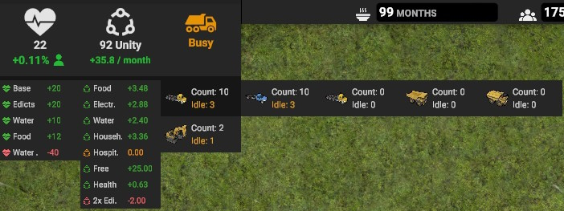
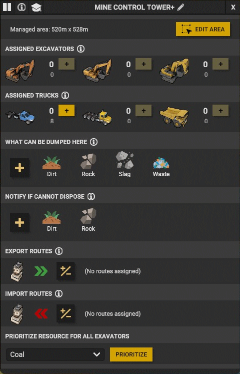
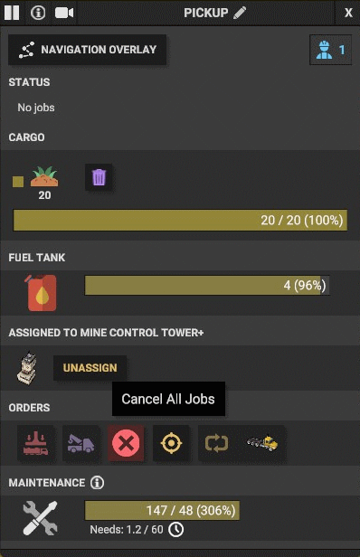
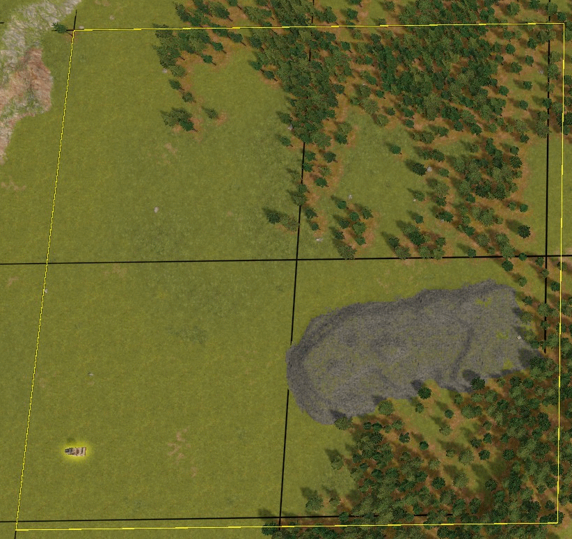
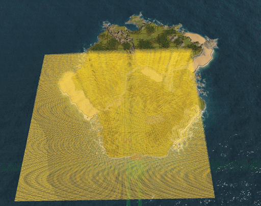
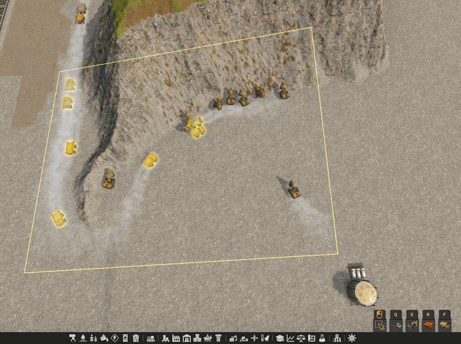
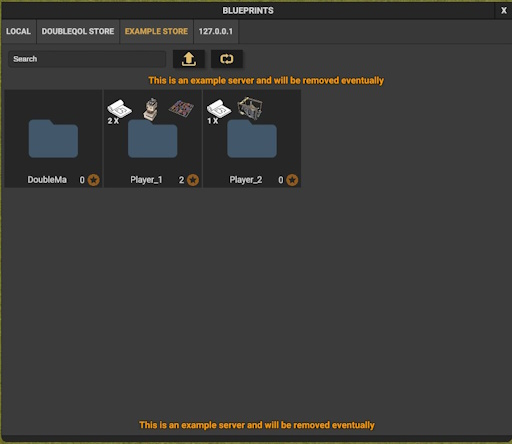

## DoubleQoL

A mod for [Captain of Industry game](https://www.captain-of-industry.com/).

工业队长（工业部长、工业巨头）游戏的模组，主要提供游戏倍速功能。

本仓库只提供中文翻译，与原作者无任何关系。

原作者仓库地址：[DoubleQoL](https://github.com/DoubleMa/DoubleQoLMod)

### Features（特性）:

- Add a game speed controller that can speed up the game up to x10. [numb8-numb9]
- 添加游戏速度控制器，可将游戏速度提高至 10 倍。 [数字8-数字9]
- Free camera mode with a 6000 max pivot distance. [F9]
- 自由相机模式，最大旋转距离为 6000。 [F9]
- Enable or disable fog. [F10]
- 启用或禁用雾。 [F10]

    

- Add more info under the statusbar [Right-click on any of the health, unity, or truck icons]
- 在状态栏下添加更多信息 [右键单击任何健康、凝聚力或卡车图标]
    

- Add a field in the MineTower view where you can prioritize a specific resource for all excavators
- 在控制塔视图中添加一个字段，您可以在其中为所有挖掘机确定特定资源的优先级

    

- Add a btn in the vehicle view where you can cancel all jobs
- 在车辆视图中添加一个按钮，您可以在其中取消所有作业

- Change the area size of terrain designations, selection tools and towers (MineTower and ForestryTower)
- 更改地形名称、选择工具和塔（MineTower 和 ForestryTower）的面积大小
     
  
- Add a vehicle tool that can select and move all/specific vehicle
- 添加可以选择和移动所有/特定车辆的车辆工具

    
  
- Add an in-game Blueprint store where you can share and download blueprints.
- 添加游戏内蓝图商店，您可以在其中共享和下载蓝图。

    
  
## Installation-安装

1. Download the latest zip file from the GitHub Release.
2. Extract the zip file to the `%USERPROFILE%\AppData\Roaming\Captain of Industry\Mods` directory.
3. In the game settings, under the Miscellaneous tab, toggle "Modding" button.
4. When you start a new game, make sure to select DoubleQoL under the "Mods to Include" section. If you're loading an old save, be sure to click on "Mods" in the loading view and select DoubleQoL.

1. 从 GitHub Release 下载最新的 zip 文件。
2. 将 zip 文件解压到 `%USERPROFILE%\AppData\Roaming\Captain of Industry\Mods` 目录。（该目录可在游戏内保存存档或加载存档时看到）
3. 在游戏设置的“杂项”选项卡下，切换“模组”按钮。
4. 当您开始新游戏时，请确保在“要包含的模组”部分下选择 DoubleQoL。 如果您要加载旧存档，请务必在加载视图中单击“Mods”并选择 DoubleQoL。

## Configuration-配置

The zip file includes a `DoubleQoL.dll.config` file. You can enable/disable any QoL feature and change the control key for each one.

1. The "QoLs" section allows you to enable or disable a QoL.
2. The "KeyCodes" section allows you to change the KeyCode for each supported QoL.
3. The "DefaultState" section lets you set the default state for specific QoL features when you start the game.
4. The "BlueprintServers" section allows you to add a private or public server for the BlueprintQoL.
  
该 zip 文件包含一个“DoubleQoL.dll.config”文件。 您可以启用/禁用任何 QoL 功能并更改每一项的控制键。

1. “QoL”部分允许您启用或禁用 QoL。
2. “KeyCodes”部分允许您更改每个支持的 QoL 的 KeyCode。
3.“DefaultState”部分可让您在开始游戏时设置特定 QoL 功能的默认状态。
3. “BlueprintServers”部分允许您为 BlueprintQoL 添加私有或公共服务器。

## Disclaimers-免责声明

This mod is primarily designed for personal use, and I am sharing it on GitHub as a courtesy to the community. Please be aware that this mod may not receive regular updates, maintenance, or support. It is provided "as-is," without any warranties or guarantees of functionality, compatibility, or security.

I encourage you to use this mod with caution, and it is your responsibility to ensure its compatibility with your specific software or environment. I am not liable for any issues, damages, or data loss that may occur as a result of using this mod.

If you encounter problems or have questions, feel free to open an issue on this GitHub repository, and I will do my best to assist, but please understand that my availability for support may be limited. You are also welcome to fork, modify, or improve the mod according to your needs.

By using this mod, you agree to the terms outlined in this disclaimer.

这个 mod 主要是为个人使用而设计的，出于对社区的礼貌，我在 GitHub 上分享了它。 请注意，此模组可能不会收到定期更新、维护或支持。 它按“原样”提供，不提供任何功能、兼容性或安全性的保证。

我觉得您应该谨慎使用此模组，并且您有责任确保其与您的特定软件或环境的兼容性。 对于因使用此模组而可能发生的任何问题、损坏或数据丢失，我不承担任何责任。

如果您遇到问题或有疑问，请随时在此 GitHub 存储库上提出问题，我将尽力提供帮助，但请理解我提供的支持可能有限。 也欢迎您根据需要分叉、修改或改进该模组。

使用此模组即表示您同意本免责声明中列出的条款。
